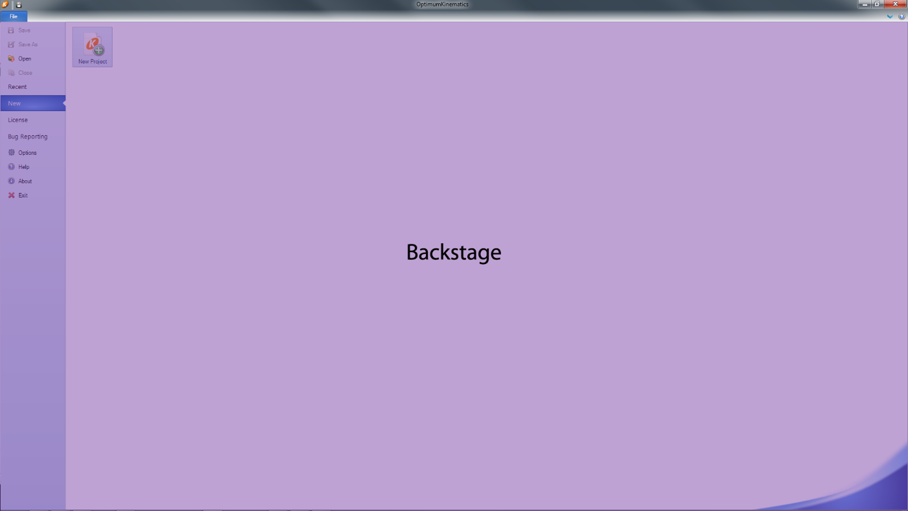
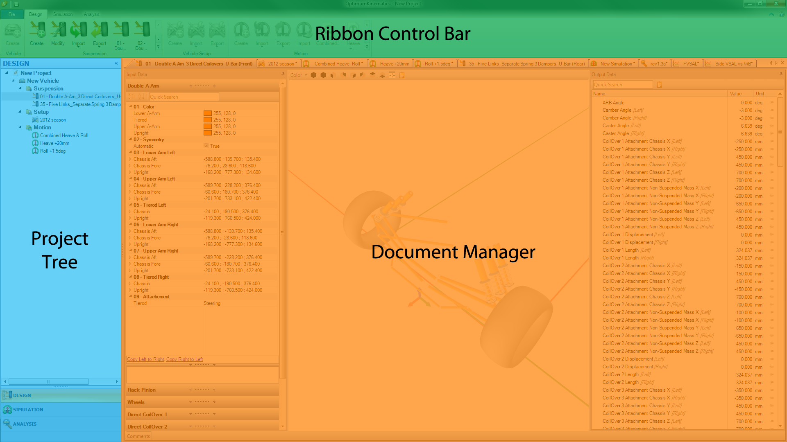

---
Title: Launching the Application
summary: This section contains the information about the Graphical User Interface and how to manage projects.
authors:
    - Pedro Brasil
date: 2019/8/28
---
# Launching the Application

## Graphical User Interface

When opening the software, the first thing you see is the  __Backstage__ . Here, you can manage your projects and adjust [Licensing](../1_Introduction/A) and projects [Options Menu](../2_Quick_Start/B_Options_Menu.md).

Once you create a project, you automatically leave the  __Backstage__  and enter the Main GUI. In the Main GUI:

* The top is the  __Ribbon Control Bar__  with all shortcuts to functionalities of the software.
* The center is the  __Document Manager__  where you may edit project files.
* The left contains the  __Project Tree__ , which allows you to organize project files.

The  __Ribbon Control Bar__  contains all the buttons that help you interact with the application.

The  __Document Manager__  allows the user to have multiple tabbed documents openned at the same time. The tabs can be dragged and dropped to be displayed side by side, or in any other configuration on the same screen. Also, the user performs any design, simulation, or analysis functionality here. In the Options Menu, it is possible to change the color of these tabs to aid in keeping things organized.

The  __Project Tree__  allows you to manage all aspects of your project. Vehicles can be added and organized into differing subfolders, likewise with the suspensions, setups, forces, and motions in the project.

## Creating a New Project

The first step is to create a new project. To do this, click the __New Project__ button under the file tab. You are then asked to select a name and a directory for your project.

Upon creating a new project, the software creates a folder on your hard drive in the selected directory. This directory is used to save all the files related to your project. The different files that you may find are:

|Name|Extension|Icon|
|:---|:---:|:---:|
|Project File      |.O2Pro||
|Suspension File   |.O2Sus||
|Vehicle Setup File|.O2Set||
|Motion File       |.O2Mot||
|Force File        |.O2For||
|Simulation File   |.O2Sim||
|Result File       |.O2Res||
|Chart File        |.O2Cha||
|Table File        |.O2Tab||
|View File         |.O2Vie||
|Worksheet File    |.O2Wor||
|User File         |.O2Uso||

## Opening an Existing Project
When it comes time to open an existing project, you must know the location of the directory in which the project files are. Within the folder, you should find the OptimumKinematics Project File (.O2Pro). To open the project, click on the “Open” button in the  __Backstage__  so the “Open Project” dialog box opens. In the dialog box, navigate to your project’s folder and select the OptimumKinematics Project File (.O2Pro). Click “Open” to open the project.

## Saving a Project
The project can be saved using the __Save__ button in the  __Backstage__  ([Graphical User Interface](#graphical-user-interface), under File) or using the shortcut (Ctrl + S). The project can be saved to another location using the __Save As__ button in the Backstage or using the keyboard shortcut (Ctrl + Shift + S).

When closing the application, the application asks if you want to save the project, if you have not already.
