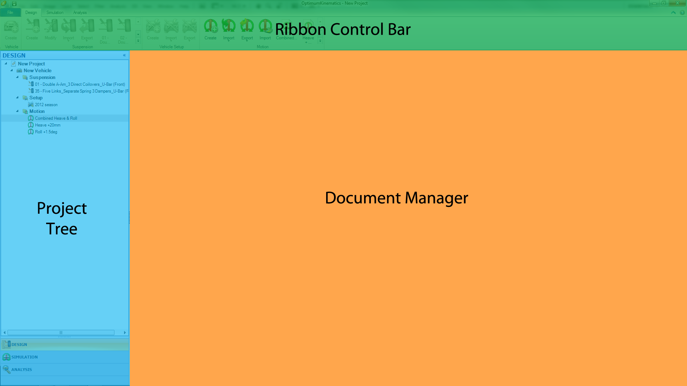
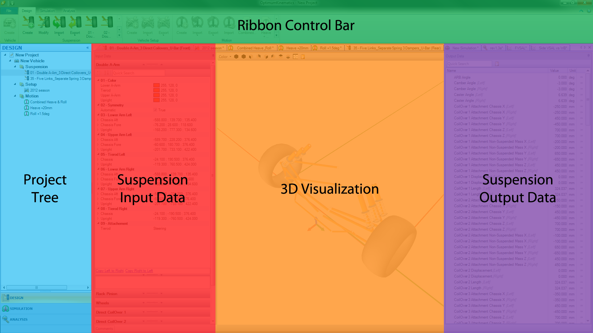
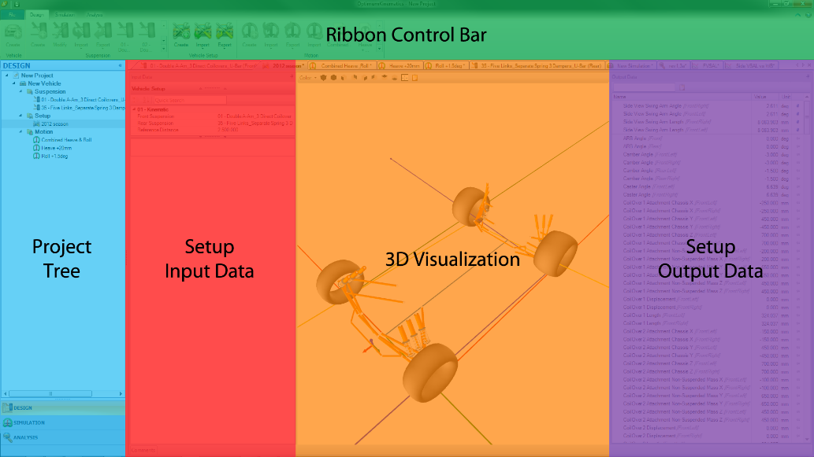
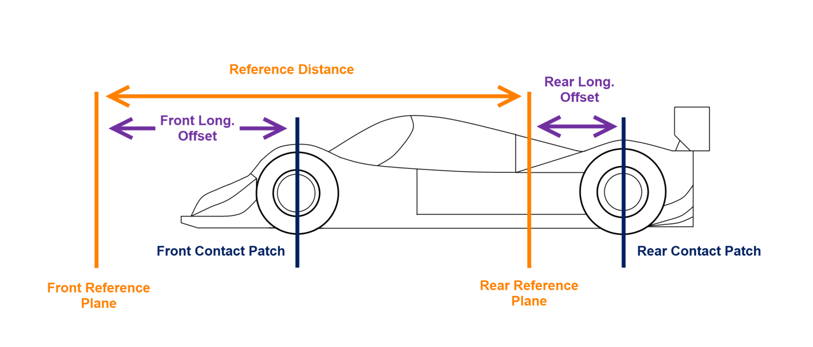
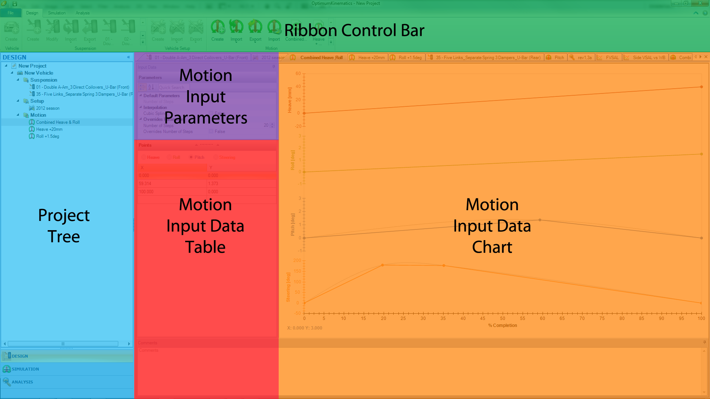
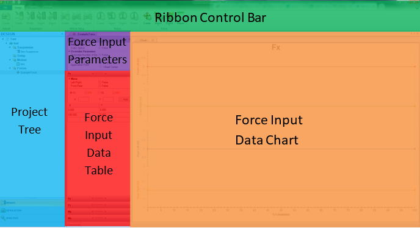

---
Title: Design Overview
summary: This section contains information about the Suspension, Vehicle Setup, Force and Motion features.
authors:
    - Paulo Yamagata
    - Pedro Brasil    
date: 2019/4/26
---

# Design Overview

The design section is where the [Suspension](##Suspension-Design), [Vehicle Setup](##Vehicle-Setup), [Force](##Force), and [Motion](##Motion) profiles are constructed and managed.

Selecting each of the following sections under the  __Project Tree__  brings it up in the  __Document Manager__ . 

* [Suspension](##Suspension) contains all the front and rear suspension systems that have been created, with some static output channels available for immediate review in real-time for each suspension.
* [Vehicle Setup](##Vehicle-Setup) contains the vehicle setups and front and rear suspension configurations, with some static output channels available for immediate review in real-time.
* [Force](##Force) contains the forces profiles that the user may apply in simulation.
* [Motion](##Motion) contains the motion profiles for simulation.

The first step is to create a new vehicle by clicking on the __Create Vehicle__ button on the  __Ribbon Control Bar__ . This new type of object in OptimumKinematics helps the user to have better organization. All elements created under the vehicle belongs to a library of objects available for the given vehicle. These objects can be copied, pasted, or moved to another vehicle or subfolder for better organization.

## Suspension

The next step is to make a suspension design. Three main options exist:

* [Creating a Suspension](../3_Detailed_Overview/B_Design.md#Creating-a-Suspension). You can select the type of geometry, the type of actuation and anti-roll bars from an extensive library of elements.
* [Importing and Exporting Suspension](../3_Detailed_Overview/B_Design.md#Importing-and-Exporting-Suspension). You may choose to import from an Excel file, OptimumKinematics file, or Excel file.
* [Default Suspension Types](../5_Reference_And_Appendix/A_Default_Suspension_Types.md). Choose from one of the premade available files.
Currently, you can adjust all the connection points between the components to match that of your actual design. 

## Suspension Design

The suspension design  __Document Manager__  includes the following sections:

*  __Suspension Input Data__. Here, the user enters with all of the suspension data points, stiffnesses of the springs, anti-roll bars, or other elastic components (as applicable), as well as parameters for visualization colors, wheel, and rim information as well as reference points.
*  __3D Visualization__. Here, the user can edit the suspension data points by double-clicking on the suspension points in the  __3D Visualization__ window. Rotation, zooming, and panning (in all directions) are possible by either left, middle and right-clicking, and dragging the mouse. Additional visualization of the roll axis, pitch axis, and instant centers are available by enabling the display options in the Options Menu, located on the projects Backstage (Graphical User Interface, under File). 
*  __Suspension Output Data__. This pane displays the output data of all available data channels at static. Points edition updates information (such as roll center location, mechanical trail, scrub radius, caster, and KPI angle, as well as all other available data channels) in real-time.
* __Comments__. Add comments to your design to help maintain organization.

The controls can be resized and minimized to maximize your working space. It is also important to remember that the suspension setups can be modified, renamed, and exported. 

## Vehicle Setup

The vehicle setup feature OptimumKinematics is where the user can mate front and rear suspensions to form a vehicle for simulation.
The vehicle setup design includes the following sections:

*  __Setup Input Data__. Here, the user can assign front and rear suspension setups to a vehicle setup, as well as the reference distance. Note - this is the distance between the front and rear reference planes and is not necessarily the same value as the wheelbase.

*  __3D Visualization__. Rotation, zooming, and panning (in all directions) are possible by either left, middle and right-clicking, and dragging the mouse. Additional visualization of the roll axis, pitch axis, and instant centers are available by enabling the display options in the [Options Menu](../2_Quick_Start/B_Options_Menu.md), located on the projects  __Backstage__  ([Graphical User Interface](../2_Quick_Start/A_Launching_the_Application.md#Graphical-User-Interface), Under File). 
*  __Setup Output Data__. Check the static output of a suspension, such as its roll center, mechanical trails, scrub radius, caster, and KPI angle.
* __Comments__. Add comments to your design to help maintain organization.
The  __Ribbon Control Bar__  contains options to import setups from other OptimumKinematics Projects or excel files. When importing from an OptimumKinematics Project, keep in mind that the .O2Set files only contain references to the front and rear suspension files. So, the software does not import the actual front and rear suspensions. For this reason, we recommend exporting a setup from one project before importing it to another, rather than directly realocating the files on your hard drive.

## Motion

Motion allows for the creation of motion paths for simulation. Motion profiles can be created by hand, imported from previous files or imported from logged track data.
Four options are available on the  __Ribbon Control Bar__  to create a motion profile:

* [Creating a Motion](../3_Detailed_Overview/B_Design.md#Creating-a-Motion). You can enter the points graphically or numerically.
* [Importing and Exporting Motion](../3_Detailed_Overview/B_Design.md#Importing-and-Exporting-Motion-Profiles). From an Excel file, CSV file, or an OptimumKinematics motion file.
* [Import Track Data](../3_Detailed_Overview/B_Design.md#Import-Track-Data). From a data acquisition system.

The motion  __Document Manager__  includes the following:

*  __Motion Input Parameters__  allows customization of the number of simulation steps and the type of the interpolation of the motion points (linear or spline).
*  __Motion Input Data Table__  allows motion data points to be entered, modified, or deleted. Selecting between Heave, Roll, Pitch, and Steering switches the current motion profile between the different types. Any combination of the vehicle in different states of Heave, Roll, Pitch, and Steering may compose a Motion.
*  __Motion Input Data Chart__  allows motion profile points to be added, removed, or edited via a graphical interface. A Left-Click adds a data point at the location of your mouse, while a Right-Click removes a data point at the location specified by your mouse. Ctrl + Left-Click moves a data point. By clicking the different types of motion with the mouse’s left button, the corresponding motion’s chart becomes active for edition, as indicated by the mouse cursor color.
* __Comments__. Add comments to your design to help maintain organization.

## Force

Force allows the user to determine how the vehicle is being loaded based on the applied forces at the contact patch or the wheel center. The user can apply forces as either a custom input, an imported force file, or as imported data from OptimumDynamics or wheel force transducer data.

The OptimumKinematics Forces Module solves the system as a rigid multi-body system to calculate the forces at each joint.  For each motion state, the software displays the system as fixed and solves the forces and moments for each joint.  A way to understand the solver is by thinking that it continually creates and solves free body diagrams for each link, allowing for rapid calculation of the forces in the system. Notice that assumptions are necessary for which joint type (if it transmits or not forces and moments in each direction) is appropriate in each connection, which influences the results. In case of an overconstrained system (for example a double A-arm suspension with a direct Coilover and U-bar), the relative stiffness and the motion ratios of the force elements determine the distribution of forces between the elements.

The simulation forces can be created as follows in the  __Ribbon Control Bar__ :

The force  __Document Manager__  includes the following:

*  __Force Input Parameters__  allows users to determine the number of steps to use in the simulation, the application point of the forces, and the interpolation type of the force points.
*  __Force Input Data Table__  is where the user can input the magnitude, direction, and location of the suspension forces throughout the simulation.  The user may enter the forces and moments at each corner, being possible to mirror the forces left to right or front to rear, as desired.
*  __Force Input Data Chart__  shows how the forces change through the duration of the simulation.  There is also an ability to see the force vectors throughout the simulation by selecting the 3D tab at the top of the chart area. This visualization can help in understanding the convention and direction of the forces.
* __Comments__ can be used to describe the files and keep an organization of the files.
