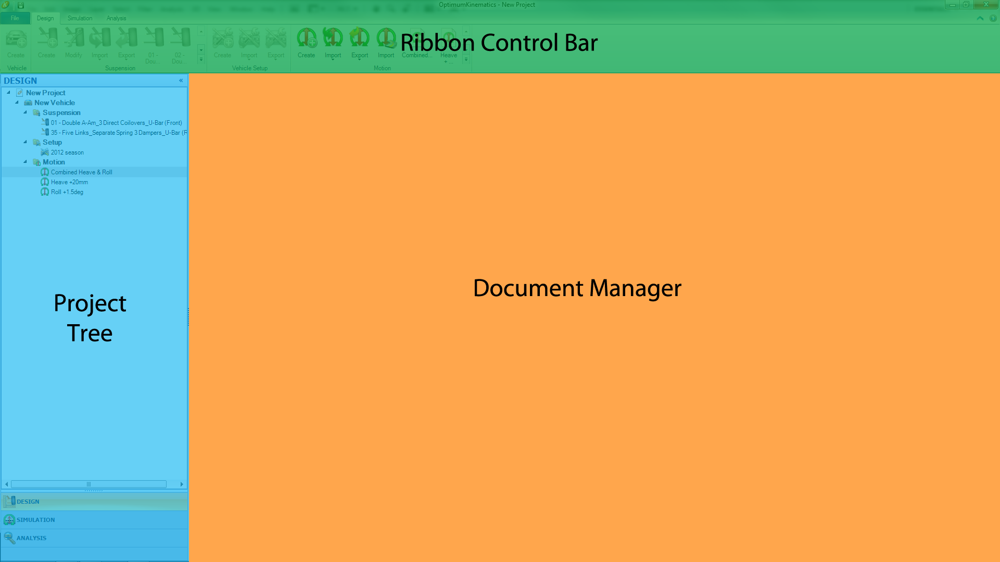

---
Title: Design Overview
summary: 
authors:
    - Paulo Yamagata
    - Pedro Brasil    
date: 2019/4/26
---

# Design Overview

The design section is where the [Suspension](##Suspension-Design), [Vehicle Setup](##Vehicle-Setup), [Force](##Force), and [Motion](##Motion) profiles are constructed and managed.
Selecting each of the following sections under the Project Tree brings it up in the Document Manager. 

* [Suspension](##Suspension) contains all the front and rear suspension systems that have been created, with some static output channels available for immediate review in real-time for each suspension.
* [Vehicle Setup](##Vehicle-Setup) contains the vehicle setups and front and rear suspension configurations, with some static output channels available for immediate review in real-time.
* [Force](##Force) contains the forces profiles that the user may apply in simulation.
* [Motion](##Motion) contains the motion profiles for simulation.

The first step is to create a new vehicle by clicking on the Create Vehicle button on the Ribbon Control Bar. This new type of object in OptimumKinematics helps the user to have better organization. All elements created under the vehicle belongs to a library of objects available for the given vehicle. These objects can be copied, pasted, or moved to another vehicle or subfolder for better organization.

## Suspension

## Suspension Design

## Vehicle Setup

## Motion

## Force
