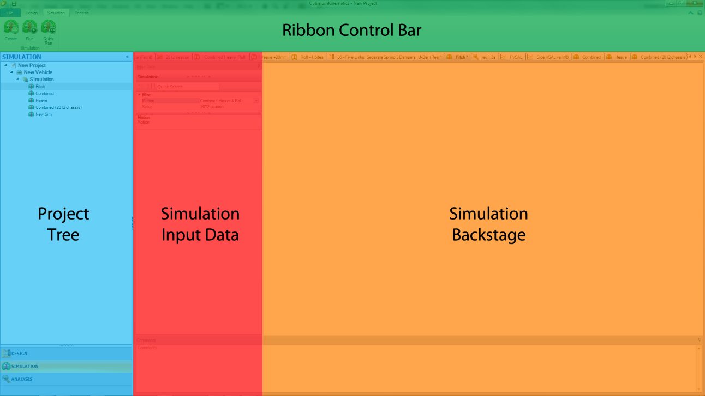

# Simulation Overview

The simulation  __Document Manager__  contains just one main section, the  __Simulation Input Data__  pane, which allows the mating of vehicle configurations and motion profiles to each other, and the running of simulations.

Two options are available in the  __Ribbon Control Bar__  to create a simulation:

* __Create Simulation__. This option allows you to re-run the same simulation with the saved [Suspension](../2_Quick_Start/C_Design_Overview#Suspension-Design), [Vehicle Setup](../2_Quick_Start/C_Design_Overview#Vehicle-Setup), [Force](../2_Quick_Start/C_Design_Overview#Force), and [Motion](../2_Quick_Start/C_Design_Overview#Motion).
    * __Single Iteration__. Same properties as the quick run.  Allows for a repetitive analysis without needing to keep changing the quick run.
    * __Batch Run__. When utilizing the batch run feature, you can simulate ONE vehicle setup, ONE motion, and ONE force over a variety of user-chosen pickup points and compare the results. See [Create/Run](../3_Detailed_Overview/C_Simulation.md#Create/Run) in [Detailed Overview](../3_Detailed_Overview/C_Simulation.md) for more information.
    * __Design of Experiment__. This feature allows you to select MULTIPLE vehicle setups and MULTIPLE motions and compare the results. See [Create/Run](../3_Detailed_Overview/C_Simulation.md#Create/Run) in [Detailed Overview](../3_Detailed_Overview/C_Simulation.md) for more information.
* __Quick Run Simulation__. With this option, you need to select the [Suspension](../2_Quick_Start/C_Design_Overview#Suspension-Design), [Vehicle Setup](../2_Quick_Start/C_Design_Overview#Vehicle-Setup), [Force](../2_Quick_Start/C_Design_Overview#Force), and [Motion](../2_Quick_Start/C_Design_Overview#Motion) each time.

Next step is to __Run__ the simulation to acquire the Results. When running the simulation, a progress bar shows the completion of the simulation and 3D Visualization. A simulation can be canceled or stopped at any time. 

NOTE - If you stop the simulation you can view the results up until the stop point, but if you cancel it the results are not saved.

Once the simulation has finished, OptimumKinematic automatically displays the Results Tab in the  __Document Manager__ .

When using the __Quick Run__ feature, it is necessary to define which [Suspension](../2_Quick_Start/C_Design_Overview#Suspension-Design), [Vehicle Setup](../2_Quick_Start/C_Design_Overview#Vehicle-Setup), [Force](../2_Quick_Start/C_Design_Overview#Force), and [Motion](../2_Quick_Start/C_Design_Overview#Motion). The feature is perfect for getting to analysis in a hurry. If you plan on running the same simulation for multiple different types of motion, it would be beneficial to create the simulation, so all you have to do is click __Run__ to run the simulation.
