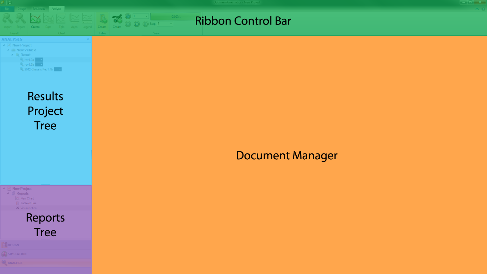
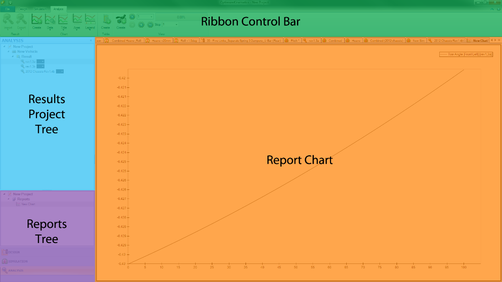
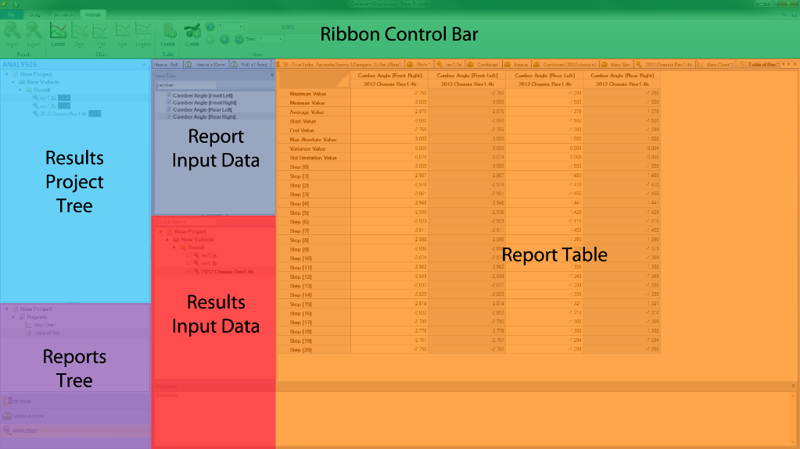
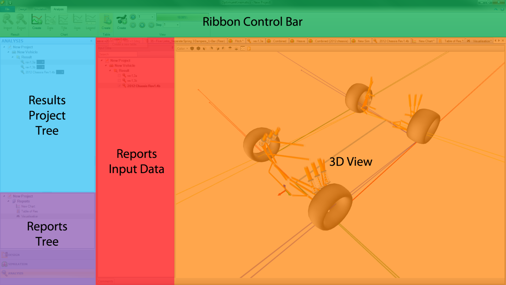
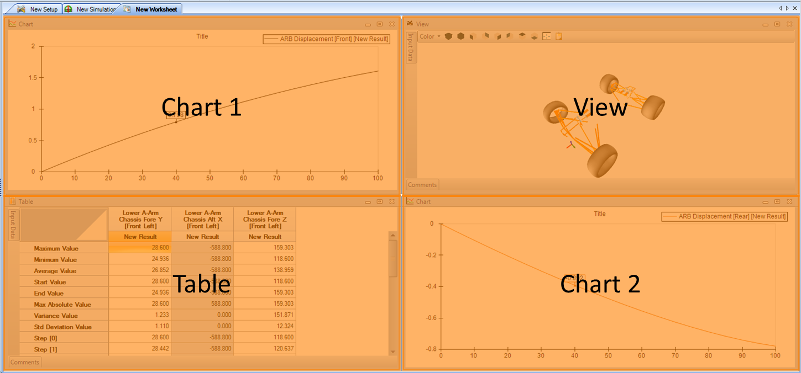

# Analysis Overview

After the simulation is complete, OptimumKinematics creates a result file. Then, it allows the display of a preview of the result file in the  __Document Manager__ , either in table or chart format. The selected channels for display in the preview chart (or table) are a global setting and so, are shared across all projects and results.

Selecting results from the  __Results Project Tree__  brings up a quick preview of the data in the  __Document Manager__ . After selecting the  __Reports Tree__ , the user may add a new report. Three kinds of reports are available:

* [Chart](##Chart). Create a chart showing the selected data for the X and Y-axis.
* [Table](##Table). Create and compare tabular data between simulations.
* [View](##View). Create 3D Visualizations so you can spacially see what is happening in your simulation.
* [Worksheet](##Worksheet). Create an arrangement of Charts, Tables, and Views to assist in the analysis process.

## Chart

Report Charts allow the graphical plotting of two variables and their relationship to each other. One chart can accommodate multiple results, with the option to implement a secondary axis. Charts are fully customizable using the buttons on the  __Ribbon Control Bar__  or by clicking inside the  __Report Chart Area__ . You can find further details in the [Detailed Overview](../3_Detailed_Overview/C_Simulation.md) section.

## Table

 __Report Tables__  allow the tabular display of multiple channels across multiple runs next to each other. The user chooses channels for display through the  __Report Input Data__  pane, while the results selection happens at the  __Results Input Data__  pane. Table data can be readily copied to the clipboard (Ctrl + C) for further analysis in external programs if required.

## View

 __Report Views__  allow 3D visualization and animated playback of a vehicle through a simulation run. When the Forces Module is activated, the display of the force vectors can happen from the view window by selecting on the suspension link in the reports input data if the simulation correspondent to the selected result file had forces inputs. You may add new views from the  __Ribbon Control Bar__.

The view  __Document Manager__ contains the following:

*  __Reports Input Data__  contains a list of available simulation results for visualization. 
* In the  __3D View__  window the user can edit the suspension data points by double-clicking on the suspension points. Rotation, zooming, and panning (in all directions) are possible by either left, middle and right-clicking, and dragging the mouse. Additional visualization of the roll axis, pitch axis, and instant centers are available by enabling the display options in the [Options Menu](../2_Quick_Start/B_Options_Menu.md), located on the projects  __Backstage__ ([Graphical User Interface](../2_Quick_Start/A_Launching_the_Application.md#Graphical-User-Interface), under __File__).
* __Comments__. Add comments to your design to help maintain organization.

## Worksheet

The  __Worksheet__  allows you the ability to view multiple [Charts](##Chart), [Tables](##Table), and [Views](##View) in the same viewing window. Arrange the sheets either __Horizontally__, __Vertically__ or __Tiled__ and watch them as the simulation progresses. 

