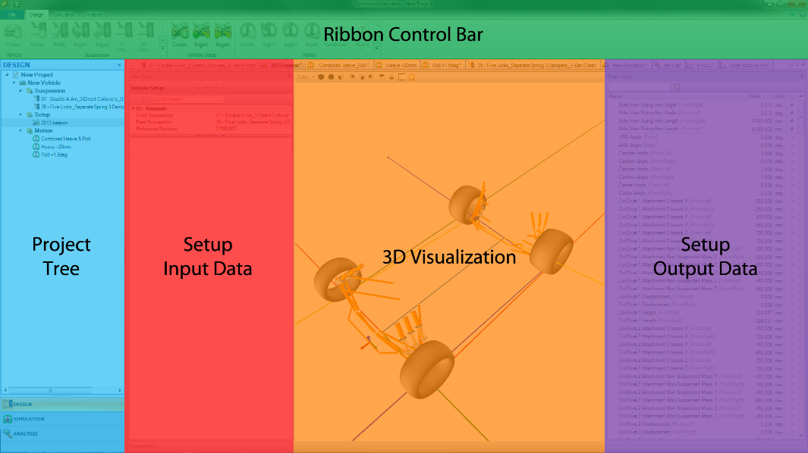
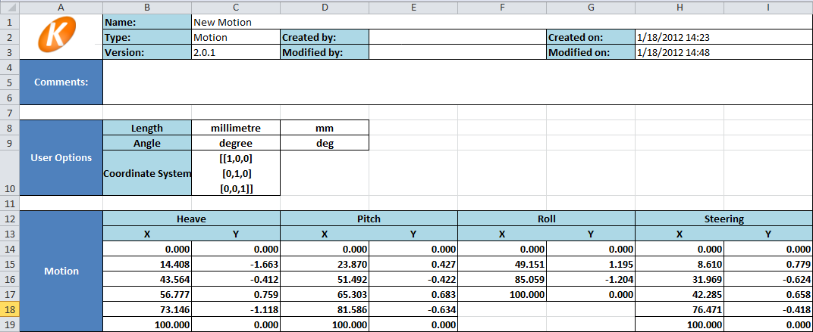
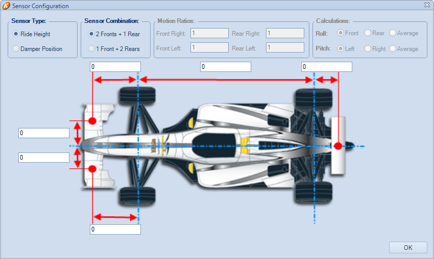
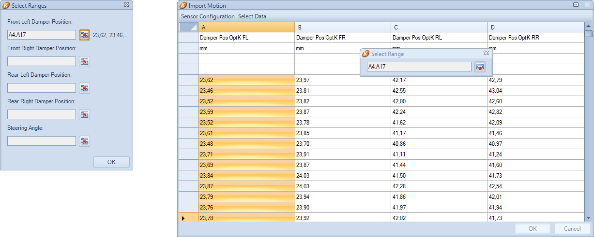
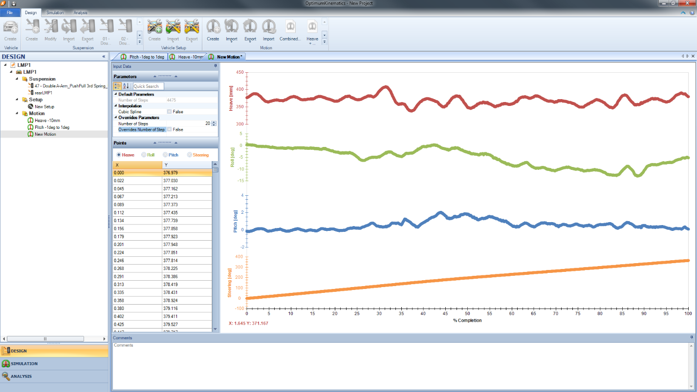
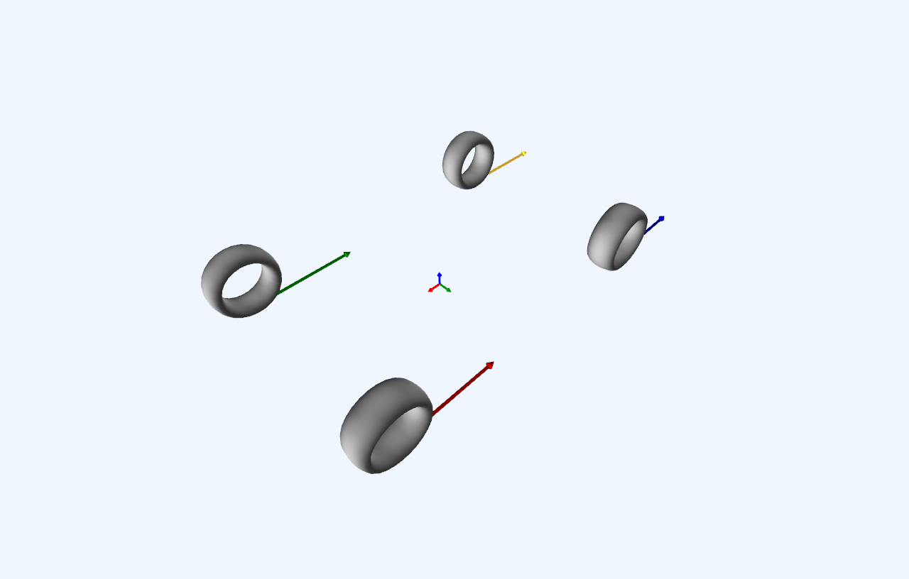
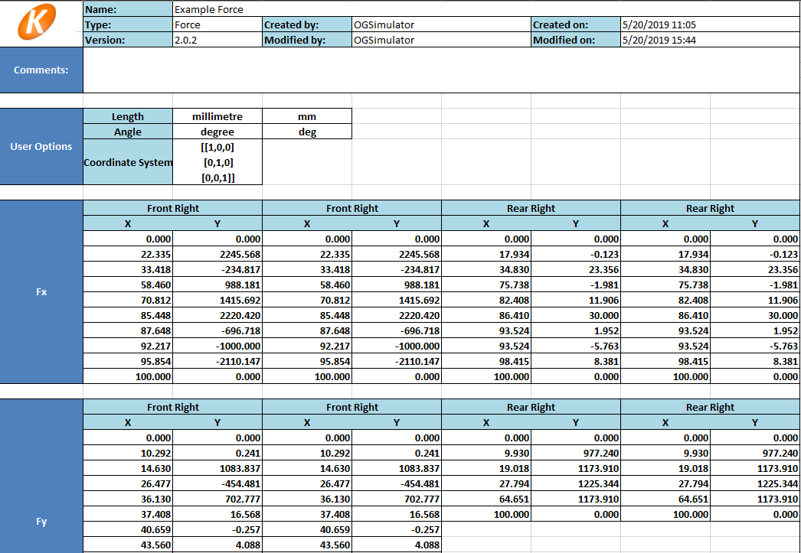
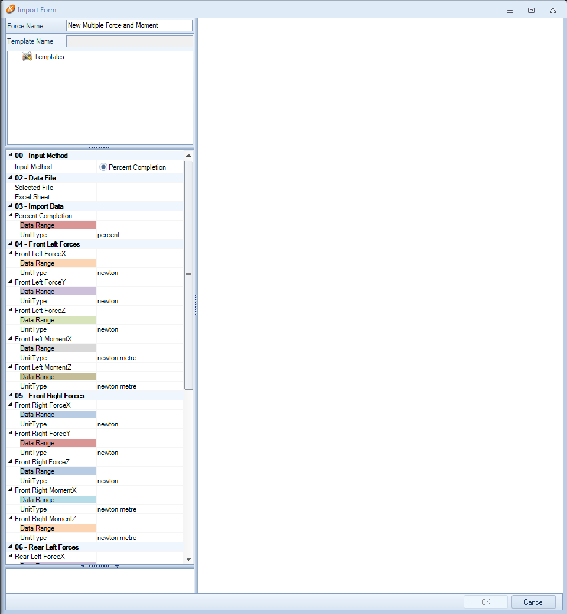
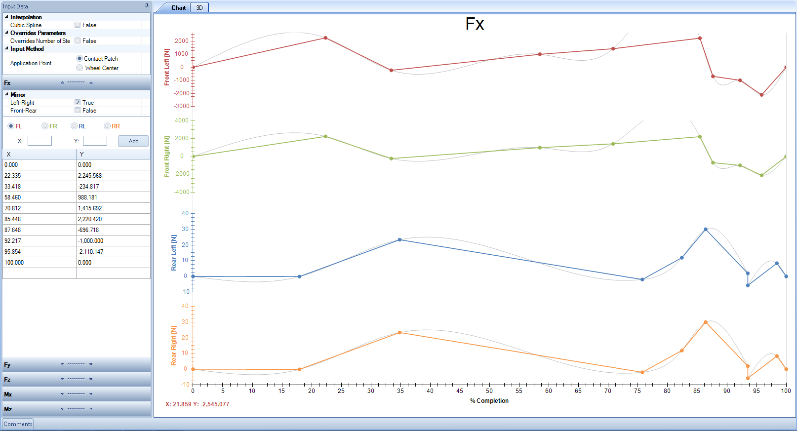

# Design

The Design section allows user control over the front and rear [Suspension Design](##Suspension-Design), the [Vehicle Setup](##Vehicle-Setup), and the simulated [Motion](##Motion) and [Force](##Force) profiles. It contains the __Project Tree__, the __Document Manager__, and the __Ribbon Control Bar__.

The __Ribbon Control Bar__ contains all relevant menu options for creating or modifying [Suspension](##Suspension-Design), [Setup](##Vehicle-Setup), [Motion](##Motion) profiles, and [Force](##Force) profiles. It also contains the option to add a new __Vehicle__ to the project, which is required to implement a suspension.

## Suspension Design

The suspension design __Document Manager__ contains three sections:

* The __Suspension Input Data__ Pane
* The __3D Visualization__ Pane
* The __Suspension Output Data__ Pane

### Creating a Suspension

After adding a __Vehicle__ to the selected project, selecting __Create Suspension__ from the __Ribbon Control Bar__ allows you to define a suspension setup.

The available options are as follows:

* Axle.
    * Front.
    * Rear.
* Geometry.
    * Double A-Arm.
    * McPherson.
    * McPherson Pivot Arm (__Front Only__).
    * Five Links (__Rear Only__).
    * Live Axle, 2 A-Arms (__Rear Only__).
    * Live Axle, 2 Trailing Arms w/ Panhard Bar (__Rear Only__).
    * Live Axle, 4 Trailing Arms w/ Watts Linkage (__Rear Only__).
* Steering (__Front only__).
    * Rack and Pinion.
    * Recirculating Ball.
* Actuation.
    * Direct Coilover.
    * Separate Springs/Dampers.
    * Push/Pull.
    * Torsion Bar.
    * Mono Shock Rotational.
    * Mono Shock Slider.
    * Push/Pull w/ 3rd Spring.
* Number Coilovers. You can have up to 3 Coilovers.
* Actuation Attachment. Depending on the number of Coilovers, or Springs/Dampers, you can choose the attachment.
    * Upright.
    * Lower A-Arm.
    * Upper A-Arm.
    * Chassis (__Rear Only__).
    * Axle (__Rear Only__).
* Anti-Roll Bar.
    * U-Bar.
    * U-Bar Rocker.
    * T-Bar.
    * T-Bar w/ 3rd Spring.

### Input Data

After creating a suspension, you may enter additional suspension parameters in the suspension __Input Data__ pane. This pane defines all the input parameters for a given suspension, including the location of the endpoints for all suspension members, steering geometry properties, wheel, and rim information, suspension stiffnesses, and any non-suspension reference points of your choosing, such as the center of gravity or lowest bodywork points.

The figure shows how points are highlighted in red in the __3D Visualization__ when you select a point in the __Input Data__ window.

You may either give the location of each point as a list of semicolons (;) separated x, y, z points (IE - x;y;z) or individually, by expanding each x, y, z point. The values for all points should reflect their location when the car is at static.

Alternatively, a suspension point may be double-clicked upon in the __3D Visualization__ window, allowing the x, y, z coordinates to be adjusted directly from the visualization pane.

NOTE - By holding down the ‘CTRL’ key and clicking and holding, you can drag a point in the __3D Visualization__ window. While dragging the point you may notice that the coordinates in the __Input Window__ are instantaneously changing with your mouse movement.

### Output Data

After completing the information on the input tab, the corresponding information regarding the newly created suspension is available under the output tab.

Output channels can be quickly sorted through, via the __Quick Search__ box. Search results are displayed if a channel contains the search string anywhere inside the channel name.

Output items of interest may be __pinned__ to the top of the list, ensuring that they are always easier to find.

### Modify Suspension

Modifying suspension geometry allows you to ensure that the geometry created matches that of your car.

### 3D Visualization

The __Document Manager__ displays a __3D Visualization__ of the modeled suspension system. When designing a front or rear suspension, it only displays the current axle. As to entering a vehicle setup, it displays the whole vehicle suspension.

* Left-click + Drag: 	__Rotate__
* Middle-click + Drag: 	__Zoom__
* Right-click + Drag: 	__Pan__ 
* Right-click: 		__Adjust visualization options__
  
The following visualization options are available:

* Adjust Background Color
* Projection
    * Parallel
    * Perspective
* Switch to a predefined view:
    * Isometric
    * Front
    * Back
    * Left
    * Right
    * Top
    * Bottom
* Fill mode:
    * Point
    * Wireframe
    * Solid (Default)
* Copy the visualization area to the clipboard
* Fit the suspension visualization to the window.

Predefined views, fitting to the window, copying to clipboard and adjusting the background color are also accessible from the toolbar at the top.

### Importing And Exporting Suspension

Suspension configurations can be imported and exported from the __Ribbon Control Bar__. You may import both OptimumKinematics projects or Excel files, which allows the importation of OptimumK v1 files into OptimumKinematics through excel file exports from v1.

## Vehicle Setup

### Creating a Vehicle Setup

Once you have the suspension setup of your choice, the next step is to create a vehicle setup. With __Setup__ highlighted within the __Setup Input Data__ you can __Create__ a new vehicle setup.

With the __New Setup__ created, you can now assign suspension setups to the front and rear of a vehicle and apply a reference distance. Note that this is the distance between the front and rear reference planes and is not necessarily the same value as wheelbase.

### Importing and Exporting a Vehicle Setup

Use the __Import__ and __Export__ features to save and reuse your vehicle setups. Notice that when it is time to __Export__ the vehicle setup you have two options for the file type:

* OptimumKinematics Vehicle Setup File.
* Excel File.
  
The default .O2Veh setup files inside your project directory (located on your hard drive), only contains information on which suspension files are in use and the corresponding reference distance.

To import a vehicle setup, you highlight __Setup__ from the __Project Tree__, click on the __Import__ button located on the __Ribbon Control Bar__, select the file that you would like to import and click __Open__ when you are finished.

## Motion

### Creating a Motion

After selecting __Create Motion__ you have the option to add points to the Heave, Roll, Pitch, and Steering motion profiles.

Within the __Motion Input Data Chart__:

* Clicking on a Heave, Roll, Pitch or Steering graph sets that as the active motion profile to edit.
* Left-click on a point adds a point.
* Right-click on a point deletes the selected point.
* Ctrl + Left-click on a point drags the selected point.
  
Within the __Motion Input Data Table__:

* Selecting from the Heave, Roll, Pitch, or Steering radio buttons set that as the active motion profile to edit.
* Right-clicking on items in the X,Y table of points allows the deletion of a point.
* You may also copy points to and from excel

The user also has the option to interpolate the motion, resulting in smoother motion paths. The user may also override the number of steps in the simulation.

### Importing and Exporting Motion Profiles

The __Ribbon Control Bar__ contains options to either Import motion files from other OptimumKinematics projects or previously exported data in either an OptimumKinematics or Excel format.

__Important__: Make sure that the units that are in the File that you are importing match the units you have selected in the [Options Menu](../2_Quick_Start/B_Options_Menu.md).

The following figure illustrates an example of how an exported OptimumKinematics __Motion File__ would look. OptimumKinematics is looking for this format when you are importing a __Motion File__ of this type.

Once you have selected the proper file, OptimumKinematics automatically displays the [Motion](#Motion) in the __Document Manager__. At this time, you can modify the values or run the __Simulation__. 

### Import Track Data

When importing track data, you need not worry about the formatting of the Excel or CSV file. The data selection from the file happens manually to ensure that the software assigns the proper data to the proper channels. 

NOTE - The track import function is only an approximation of the chassis position as it assumes a constant motion ratio, track, wheelbase, amongst others.

The following options are available for importing track data:

* Using data from three ride height sensors in known locations.
* Using data from damper position sensors on a vehicle with known motion ratios.

The following figures shows importing track data using ride height sensors; with 2 front sensors and 1 rear sensor. Located on the __Ribbon Control Bar__ you may find the __Import__ button for track data.

Once you open the data file, OptimumKinematics displays in a window very similar to that of Excel. 

The next step is to define the layout of your sensors. You can access the environment for this by clicking on the __Sensor Configuration__ button, located at the top left corner of the data to import.

Then, the __Sensor Configuration__ window opens and let you choose the __Sensor Type__, __Sensor Combination__, and the ability to insert the distance values. Again, you need to remember to keep matching units between these distances and the chosen units in OptimumKinematics. You may change the units by accessing the [Options Menu](../2_Quick_Start/B_Options_Menu.md).

By clicking __OK__ in the __Sensor Configuration__ window, the software brings you back to the __Import Motion__ window, where you can click on the __Select Data__ button to bring you to the __Select Ranges__ window shown.

## Force

### Creating a Force

Forces are an additional element. They can either complement or replace a motion simulation.  After selecting __Create Force__, you have the option to add points to the lateral, longitudinal, and vertical force profiles. You also have the option to add points to the aligning and overturning moment profiles.  By default, forces are applied to the vehicle in a static state if a motion simulation is not run in parallel.  Otherwise, the software applies the force steps to the equivalent motion steps.

First, select the type of force that you want to create by selecting the force tab in the __Force Input Data Table__.  Each tab provides options to generate a Lateral Force (Fy), a Longitudinal Force (Fx), a Vertical Load (Fz), a Tire Aligning Moment (Mz), and an Overturning Moment (Mx).  Within each tab, you can select the corner in which to apply the force.  Care should be taken to make sure that the tire forces are in the same coordinate system as the vehicle. If the tire forces are not in the same coordinate system as the vehicle, the direction of the force vectors would be in opposite directions and could show tension rather than compression.

Within the __Force Input Data Chart__:

* Clicking on a Front Left, Front Right, Rear Left, or Rear Right graph sets that as the active force profile to edit.
* Left-click on the chart adds a point.
* Selecting the 3D tab generates a visual graphic of how the forces are changing through the simulation, aiding in direction, and magnitude checks. You can use the play button or progress bar to see the forces in different steps of the simulation.

Within the __Force Input Data Table__:

* To switch between the types of force/moment to be generated/edited, switch the selection between the Fx, Fy, Fz, Mx, Mz tabs.
* Selecting from the FL (front left), FR (front right), RL (rear left), and RR (rear right) radio buttons sets that corner as the active force profile to edit
* Select the box to mirror forces left to right or front to rear to simplify the input process
* Right-clicking on items in the X,Y table of points allows the deletion of a point
* You may also copy points to and from Excel. To copy from an Excel file, copy the data with two columns, click on the area of the table you want to paste to in OptimumKinematics, and use CTRL+V to paste the data.
  
The user also has the option to interpolate the forces, resulting in smoother force inputs and calculation. The user may also override the number of steps in the simulation to use a value different than the default one.  We recommend that the motion step size is the same as the force step size if both types of simulation are in use.

### Importing Force Data

The __Ribbon Control Bar__ contains options to either import force files from other OptimumKinematics projects or previously exported data in either an OptimumKinematics or Excel format.

__Important__: Make sure that the units that are in the File that you are importing match the units you have selected in the [Options Menu](../2_Quick_Start/B_Options_Menu.md).

The following figure illustrates an example of an exported OptimumKinematics Force File. The format is the one which OptimumKinematics expects when you import a Force File.

Once you have selected the proper file, OptimumKinematics automatically displays the Force in the __Document Manager__. At this time, you can modify the values or run the __Simulation__.

### Import Force Replay Data

The selection of forces in the import tool is much the same as the motion data import tool. You select the data in columns from an Excel or CSV file with ease and clarity. You manually select the data from the file to ensure the appropriate association between data and channel.

NOTE - The track import function replicates the forces applied at the contact patch or wheel center.  The feature does not consider compliance or other additional loads at other locations on the suspension.

To generate the imported forces, the data must have a relative completion value for the entire series.  First, select the file that contains the force data desired to import.

Once you open the data file, OptimumKinematics displays the data in a window very similar to that of Excel.  You can assign the forces to the tabs on the left. Select on the top of the column to choose the data that corresponds to the title data set.

The following figure shows how OptimumKinematics displays the data from the file after importation.

