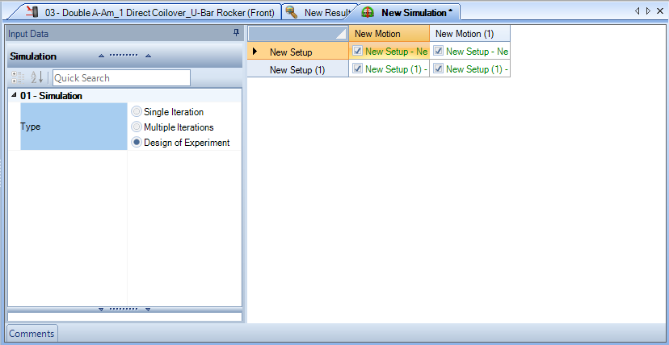

# Simulation

The simulation management settings are a new feature introduced in OptimumKinematics.  The simulation __Document Manager__ contains just one main section, the __Simulation Input Data__ pane, which allows mating vehicle configurations and motion profiles to each other, as well as the execution of simulations.

Two options are available to create a simulation:

* __Quick Run__. With this option, you need to select the  [Motion](../3_Detailed_Overview/B_Design#Motion), [Force](../3_Detailed_Overview/B_Design#Force), and [Vehicle Setup](../3_Detailed_Overview/B_Design#Vehicle-Setup) each time.
* __Create/Run__. This option allows you to re-run the same simulation with the saved [Motion](../3_Detailed_Overview/B_Design#Motion), [Force](../3_Detailed_Overview/B_Design#Force), and [Vehicle Setup](../3_Detailed_Overview/B_Design#Vehicle-Setup).

## Quick Run

When using the __Quick Run__ feature, you must choose which [Vehicle Setup](../3_Detailed_Overview/B_Design#Vehicle-Setup) to use.  You can also choose a [Motion](../3_Detailed_Overview/B_Design#Motion) or [Force](../3_Detailed_Overview/B_Design#Force) (in case you have the Forces Module active) simulation or both. The feature is perfect for getting to analysis in a hurry. If you plan on running the same simulation for a single vehicle and different motions or a single motion and different vehicles, it would be beneficial to create a simulation so you can efficiently simulate the desired cases.

## Create/Run

Next step is to __Run__ the simulation to acquire the Results. When running the simulation, a progress bar shows the simulation progress and its 3D Visualization. You can cancel or stop a simulation at any time.

NOTE - If you stop the simulation you can view the results up until the stop point, but the software discards the results if you choose to cancel.

The following figure shows the __Batch Run__ (Multiple Iterations) feature of OptimumKinematics.

When running multiple iterations, you can see how changing the location of one or multiple points can change the location of critical parameters such as roll centers, pitch center, and more. You may view these results side by side to compare your different design options. Utilizing this feature you can have only one [Motion](../3_Detailed_Overview/B_Design#Motion), one [Force](../3_Detailed_Overview/B_Design#Force), and one [Vehicle Setup](../3_Detailed_Overview/B_Design#Vehicle-Setup). The following figure shows the __Design of Experiment__ feature in OptimumKinematics.

When running a simulation using the __Design of Experiment__ feature, you can select multiple [Motions](../3_Detailed_Overview/B_Design#Motion), multiple [Forces](../3_Detailed_Overview/B_Design#Force), and multiple [Vehicle Setups](../3_Detailed_Overview/B_Design#Vehicle-Setup) and view the results side by side.

Once the simulation has finished, OptimumKinematics displays the __Results Tab__ in the Results __Document Manager__.
