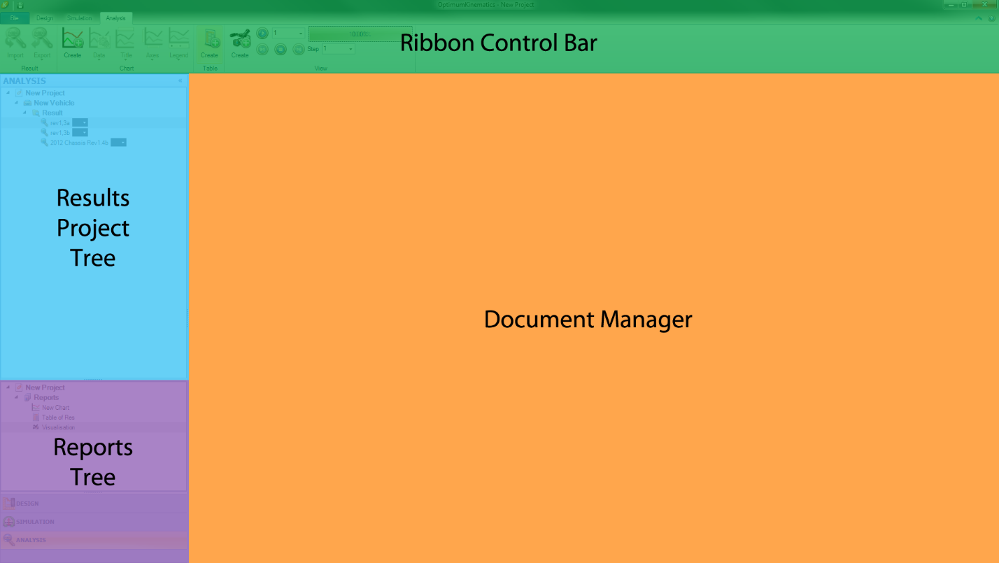
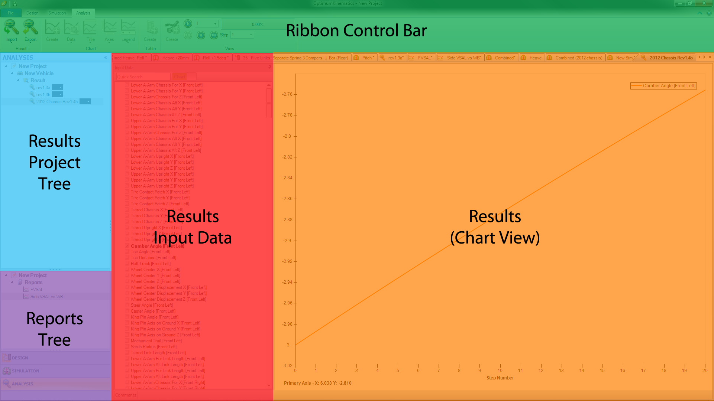
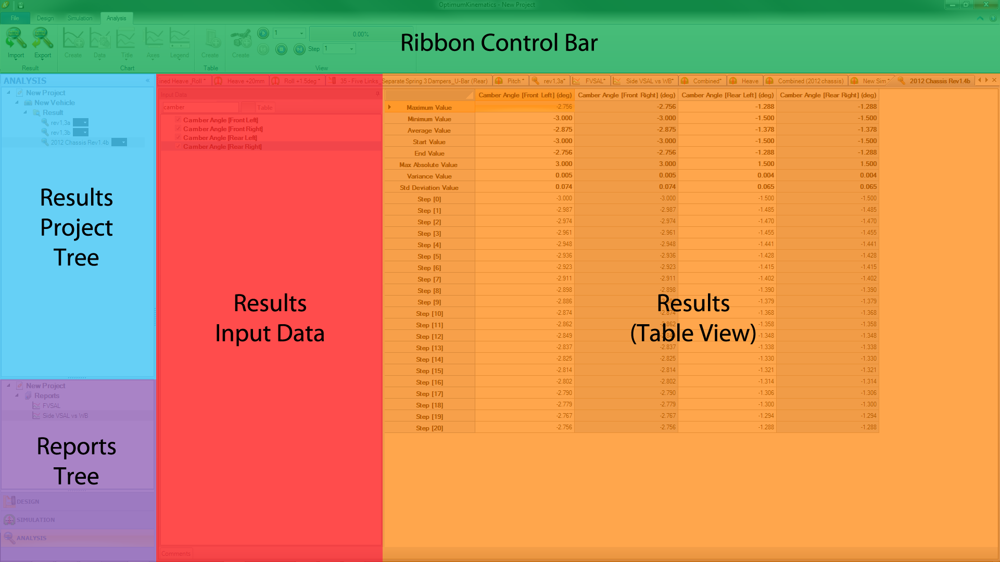
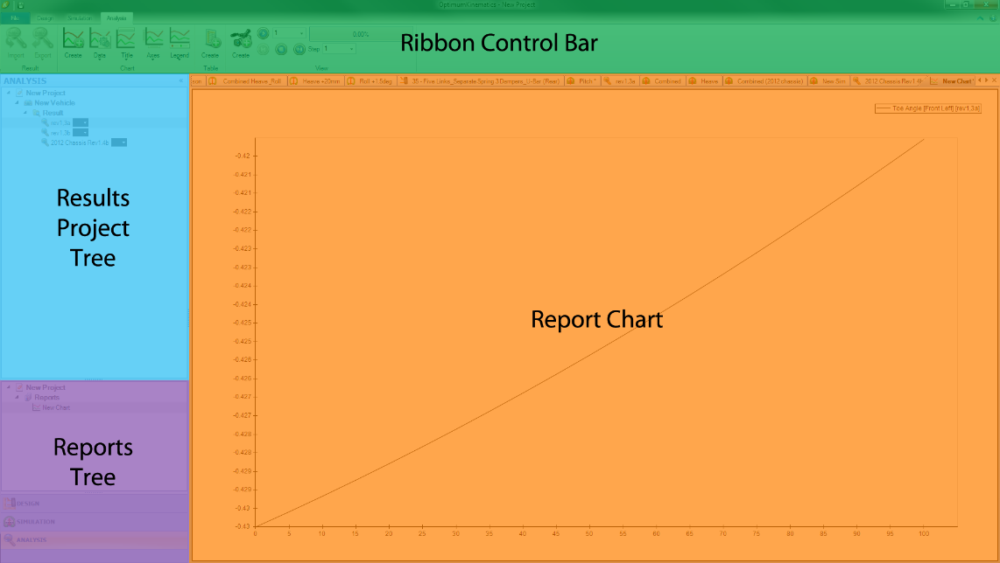
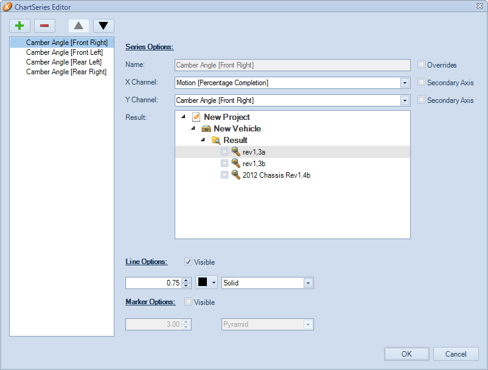
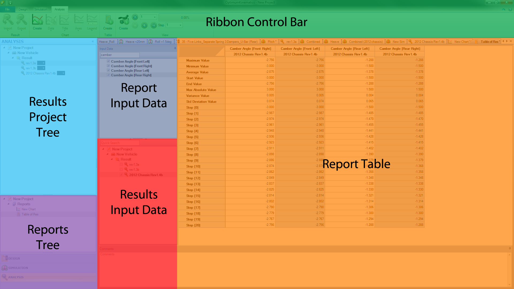
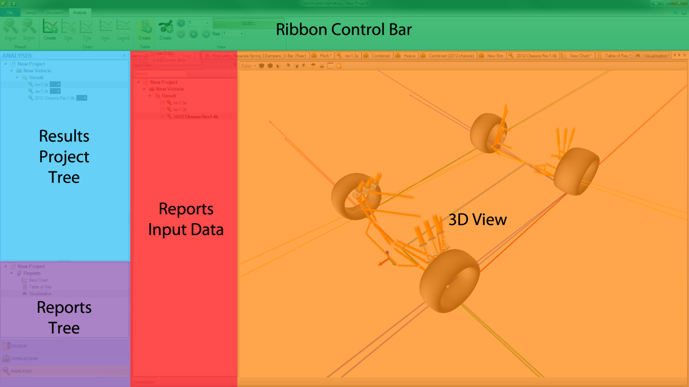
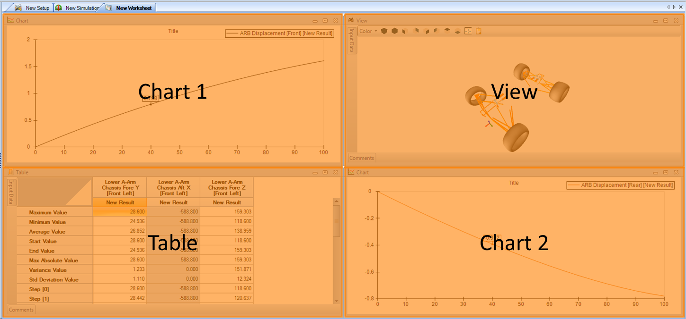
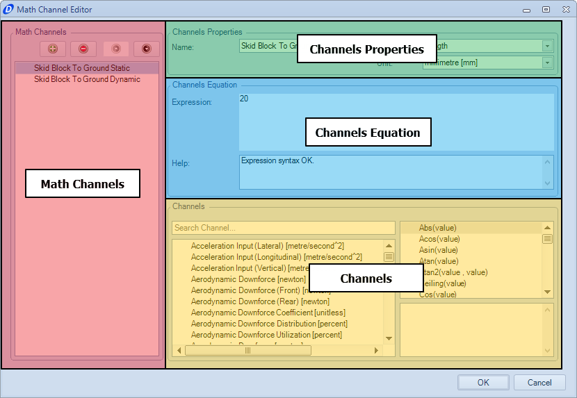

# Analysis

The analysis environment contains two __Trees__ in the left-hand pane; the __Results Project Tree__ and the __Reports Tree__.

## Analysis Results

Immediately after completing a simulation, the results are available for visualization in the __Document Manager__. OptimumKinematics generates a new set of results for every simulation run.

After selecting a set of simulation results, you can view the reported channels in either chart form or tabular form. The reported motion channels are global settings – the tables and charts display the same channels between different sets of simulation results and different OptimumKinematics projects.  The software creates the simulations’ force channels only when there are force inputs. 

Channels are available for the individual kinematic points, the roll centers, the instant centers in the front and side views for each corner, the displacement of the springs and dampers.  For each of the suspension pickup points, the force channels are Fy, Fx, Fz, Mx, My, and Mz. They can also be output as a resultant magnitude.

## Import/Export Results

You may export results to the following files. 

* OptimumKinematics [.O2res].
* Excel [.xlsx and .xls].
* CSV [.csv].

You may also import results from previous simulations using any .02Res files.

## Analysis Reports

The analysis __Reports Tree__ contains the project’s generated reports. The following reports are available:

* 2D Charts
* 3D Charts
* Tables
* Visualizations

To add a report to a project, select the project in the __Reports Tree__, and add the desired report by selecting __Create Chart__, __Create Table__, __Create View__, or __Create Worksheet__.

## Creating a Chart

In the __Report Chart__ environment, clicking __Add Chart__ brings up the __Chart Series Editor__ window. A chart may contain multiple series of data.

Each series consists of the following:

* Series Name
* X Channel
* Y Channel
* Z Channel (If you selected 3D Chart)
* Selected Results
* Line options
* Marker options

If a chart contains multiple series, it is possible to plot certain channels against a secondary axis.
When graphing a single selected result, the graphed color is the color selected under __Line Options__. As to when multiple results are graphed on the same chart, the graphed color will be that of the color nominated under the results __Project Tree__.

Each chart can display results from multiple simulation runs. The selected results can be chosen via the __Chart Series__ editor, through the Data menu option (on the __Ribbon Control Bar__) or by right-clicking on the chart.

Axis, Title and Legend options are accessible from the __Ribbon Control Bar__.

The following options are accessible by right-clicking on the chart.

* Title.
* Legend.
* Horizontal Axis.
* Vertical Axis.
* Tools.
    * Zoom/Pan.
    * Cursor.
* Data.
    * Add/Remove Series.
    * Add Result.
    * Remove Result.
    * Clear Result.
* Copy to Clipboard.
* Copy Data to Clipboard.
* Save as Picture.

## Creating a Table

Creating a table allows a user to see the numerical values at each step in the simulation. Tables also include the following calculated values:

* Maximum Value
* Minimum Value
* Average Value
* Start Value
* End Value
* Maximum Absolute Value
* Variance Value
* Standard Deviation Value.

Selecting a channel and a simulation result displays each data point in the __Report Table__. The displayed values are ready to copy to the clipboard for further processing in Excel or MATLAB®.

## Creating a View

A __3D View__ is used to visualize the motion of a suspension throughout a given simulation. After selecting __Create a View__, individual result files can be selected and played back. The __Reports Input Data__ pane lists the available simulation results for visualization.

## Animating Charts, Tables and 3D Views

The __Playback Controls__ are at the __Ribbon Control Bar__. They allow a user to replay the simulation steps, watching animations of the key values or the whole suspension system through its range of motion.  You can also visualize the magnitude of each force vector in the model by selecting the individual pickup points in the __Reports Input Data__. You can also adjust the playback speed and the step size, as well as navigate through individual frames. Selecting the progress bar allows the user to either skip or pan to a specific stage of the motion completion.

## Creating a Worksheet

The __Worksheet__ is a great way to organize and view crucial results side by side. With the ability to view them as they are changing during the simulation, this is a great way to analyze and compare different results and setups.

## Math Channels

Math channels allow you to manipulate existing signals to create new channels. You can use this feature to perform advanced analysis or to create channels that are not by default available in OptimumKinematics.

To create a math channel, go to the __Math Channels__ dropdown in the __Reports Tree__, right-click, and click the __Create__ button. After naming your channels, the __Math Channel Editor__ opens. The __Math Channel Editor__ has four sections: __Math Channels__, __Channel Properties__, __Channel Equations__, and __Channels__.

The __Math Channels__ section allows you to manage your math channels. You can add, remove, or re-order your channels by using the buttons at the top of the list.

The __Channels Properties__ section lets you define the name, the type of measurement, and the unit of measurement of the selected channel.

The __Channels Equation__ section is where you define the equation to describe your channel. Existing channels appear in single quotation marks (‘’). Channels that evaluate properly are syntax highlighted in green. The editor supports basic math operators for addition (+), subtraction (-), multiplication (*) and division (/). You may also use any supported function in the expression editor.
