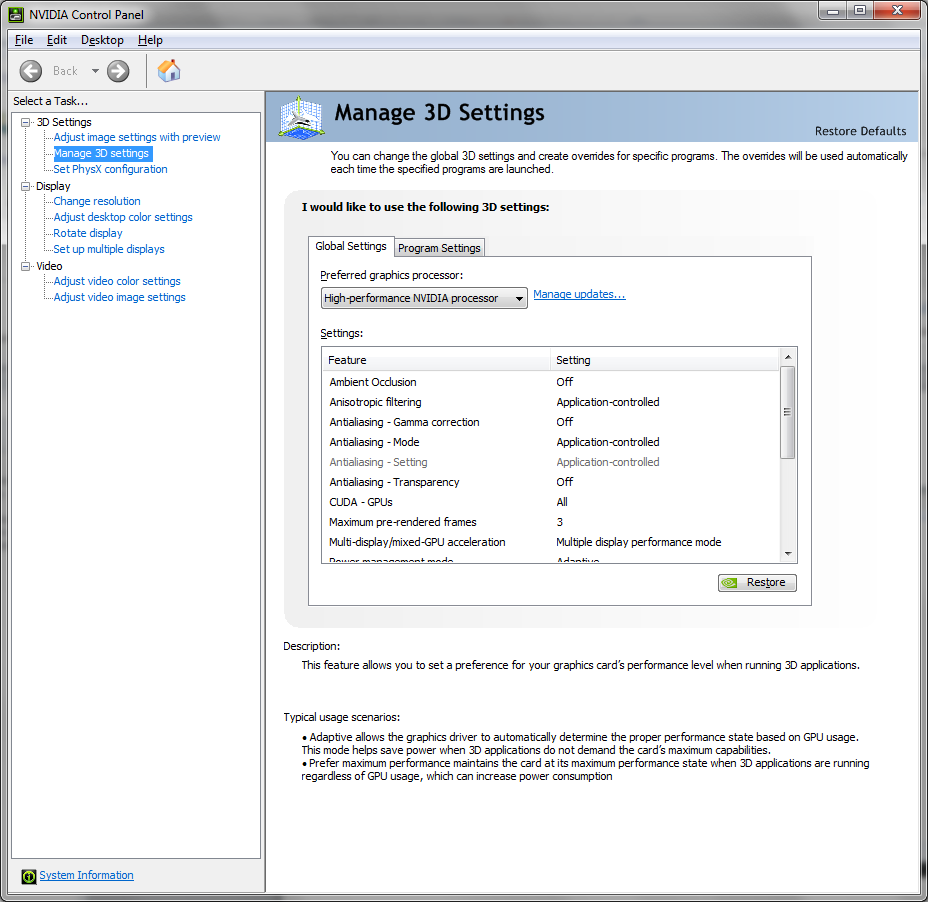

# Frequently Asked Questions

## I lost my license key.

You can find the account details for the client services center in the confirmation email sent when OptimumKinematics was purchased. If you require further assistance, please contact [software@optimumg.com](mailto:software@optimumg.com).

## How many computers can I install the software on?

A license key allows you to use the software on a single computer, but it is possible to have the software installed on multiple computers. If the software is installed on multiple computers, it cannot be used by more than one computer at any one time. This process is managed via activating and deactivating a license key manually, which does require an internet connection.

## I have no internet access to activate my license key.

If a license key is attempting to be activated (or reactivated), and a license key cannot be found, a user will have a small grace period to connect the computer to the internet. During this grace period, the program will be fully functional, but will only be able to start for a further five starts. 

## I can't install OptimumKinematics correctly.

OptimumKinematics must be installed to a location that you have permission to install to. If you are unable to install OptimumKinematics due to permission issues, please contact your network administrator.

## Can I import suspensions from previous OptimumKinematics versions?

Yes, OptimumK v1 suspensions may be imported into OptimumKinematics. They must first be exported from OptimumK v1 as an excel file, which OptimumKinematics can then import.

## Why are my instant centers, roll centers or pitch centers not calculated?

This occurs due to the instant centers being located at infinity – as is the case for truly parallel suspension setups. A method of solving this is to slightly offset the inboard or outboard pickup points by a fractional amount of one unit, allowing the instant center location to be solved. 

## When running a simulation, I receive an error message stating that solver couldn't meet the required accuracy.

This occurs when the motion paths used in the simulation exceed that of what the suspension system is physically capable of. For instance, if excessively large values for heave, roll, pitch or steering are sent for simulation, the suspension is not capable of that range of motion.

## Can I import track data into OptimumKinematics?

Yes, track data can be imported into OptimumKinematics as a motion path. Data can either come from three ride height sensors located around the car, or from suspension travel data gather from damper position sensors. The imported file format can be either Excel or .CSV files.

## Can I add to the default suspension templates on my Hard Drive?

The location of the default suspension templates is under ‘C:\Program Files\OptimumG\OptimumKinematics\Templates’. Adding exported suspension files (*.O2sus) will make these templates readily available to import into a project.

## What is the difference between Geometric and Kinematic Roll Centers?

Geometric roll centers are calculated by taking the intersection between various planes of suspension members to locate the instant centers, then taking an axis from the instant centers to the contact patch. At the point that the instant axis cross, lies the roll center. This differs for the kinematic roll center calculation, as the instant centers are not found from the intersection of the various planes but are found by iteratively applying a slight disturbance to the wheel center location, allowing movement in all six degrees. The kinematic method accounts for the effects of bump steer and steering and can be readily applied to any independent suspension type.

## Nothing shows on the 3D Visualization

If you are using NVIDIA then go under Control panel, Appearance and Personalization. You should be able to open the NVIDIA Control Panel. The window should be like the followig figure.

Select __Manage 3D Settings__ on the left tree and select __High-Performance NVIDIA Processor__ for the preferred graphics processor.

## What is the difference between heave and single wheel moton ratio for dependent and independent suspension?

The following figure is a table of values depicting the difference between the Heave Motion Ratio and the Single Right/Left Motion Ratio for an independent suspension when one degree of roll is imposed. Because the suspension components are independent you may notice that the single right motion ratio is zero with relation to the front left, but the single right motion ratio is exactly the same as the front right.

The situation changes slightly when you have a dependent suspension. In this situation there is never a zero Motion Ratio, this is because it is a dependent suspension and when one wheel is moved it will directly affect the movement of the other wheel.

