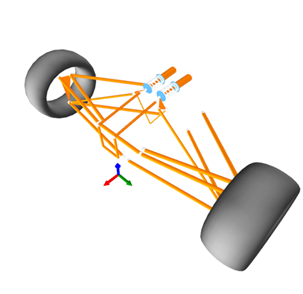
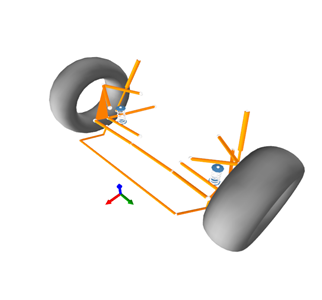

# Default Suspension Types

## Front

### Double A-Arm

|Type|Force Supported?|View Model|
|:---|:---:|:---:|
|1 Direct CoilOver & U-Bar|__Yes__||
|1 Direct CoilOver & U-Bar Rocker|__Yes__||
|3 Direct CoilOvers & U-Bar|__Yes__||
|MonoShock Rotate & T-Bar|__Yes__||
|MonoShock Slide|__Yes__||
|Push/Pull & T-Bar|__Yes__||
|Push/Pull & T-Bar (Longitudinal)|__Yes__||
|Push/Pull & T-Bar 3rd Spring|__Yes__||
|Push/Pull & U-Bar|__Yes__||
|Push/Pull & U-Bar Rocker|__Yes__||
|Push/Pull 3rd Spring & U-Bar|__Yes__||
|Push/Pull 3rd Spring chassis Constrained & U-Bar|__Yes__||
|Separate Spring 1 Damper|__Yes__||
|Separate Spring 1 Damper & R-Ball|__No__||
|Separate Spring 1 Damper & U-Bar|__Yes__||
|Separate Spring 3 Dampers & U-Bar|__Yes__||
|Torsion Bar & T-Bar|__Yes__||
|Torsion Bar 3rd Spring & U-Bar|__Yes__||

### Mac Pherson

|Type|Force Supported?|View Model|
|:---|:---:|:---:|
|U-Bar|__Yes__||
|U-Bar & R-Ball|__No__||

### Mac Pherson Pivot Arm

|Type|Force Supported?|View Model|
|:---|:---:|:---:|
|U-Bar|__Yes__||

### Mac Pherson Independent Arms

|Type|Force Supported?|View Model|
|:---|:---:|:---:|
|U-Bar|__Yes__||

## Rear

### Double A-Arm

|Type|Force Supported?|View Model|
|:---|:---:|:---:|
|1 Direct CoilOver & U-Bar|__Yes__||
|3 Direct CoilOvers & U-Bar|__Yes__||
|Monoshock Rotate & T-Bar|__Yes__||
|Monoshock Slide|__Yes__||
|Push/Pull & T-Bar|__Yes__||
|Push/Pull & T-Bar 3rd Spring|__Yes__||
|Push/Pull & U-Bar|__Yes__||
|Push/Pull & U-Bar Rocker|__Yes__||
|Separate Spring 1 Damper|__Yes__||
|Separate Spring 3 Dampers|__Yes__||
|Torsion Bar & T-Bar|__Yes__||

### Five Links

|Type|Force Supported?|View Model|
|:---|:---:|:---:|
|1 Direct CoilOver|__Yes__||
|1 Direct CoilOver & U-Bar|__Yes__||
|Monoshock Rotate & T-Bar|__Yes__||
|Monoshock Slide|__Yes__||
|Push/Pull & T-Bar|__Yes__||
|Push/Pull & U-Bar|__Yes__||
|Push/Pull & U-Bar Rocker|__Yes__||
|Separate Spring 1 Damper|__Yes__||
|Separate Spring 3 Dampers & U-Bar|__Yes__||

### Live Axle 2 A-Arms

|Type|Force Supported?|View Model|
|:---|:---:|:---:|
|1 Direct CoilOver|__No__||

### Live Axle 2 Trailing Arms

|Type|Force Supported?|View Model|
|:---|:---:|:---:|
|Panhard Bar & Separate Spring 1 Damper|__No__||
|Panhard Bar & Separate Spring 1 Damper & U-Bar|__No__||

### Live Axle 4 Trailing Arms

|Type|Force Supported?|View Model|
|:---|:---:|:---:|
|Watts Linkage & Diect CoilOver & U-Bar|__No__||
|Watts Linkage & Diect CoilOver & U-Bar Rocker|__No__||

### Mac Pherson

|Type|Force Supported?|View Model|
|:---|:---:|:---:|
|U-Bar|__Yes__||

### Multi Links

|Type|Force Supported?|View Model|
|:---|:---:|:---:|
|1 Direct CoilOver|__No__||
|1 Direct CoilOver & U-Bar|__No__||

### Semi Trailing Arm

|Type|Force Supported?|View Model|
|:---|:---:|:---:|
|1 Direct CoilOver|__Yes__||