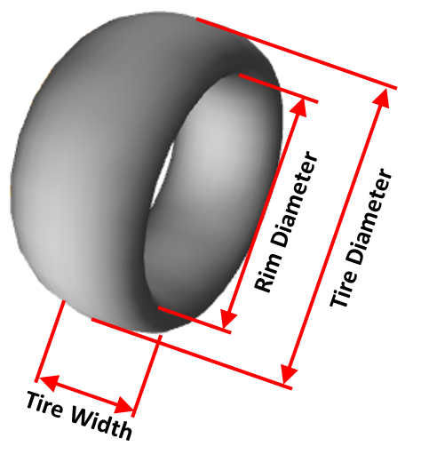

# Glossary and Definitions

## Motion Definitions

### Positive Heave

Positive heave is defined as the chassis body moving along the positive vertical axis. (Default axis: Z).

### Positive Roll

Positive roll is defined as an anticlockwise rotation about the longitudinal axis (default: X) when the longitudinal axis is viewed head-on.

### Positive Pitch

Positive pitch is defined as an anticlockwise rotation about the lateral axis (default: Y) when the lateral axis is viewed head-on.

### Positive Steering

Positive Steering is defined as the migration of the inboard steering tie rods towards the default positive lateral axis.

## Force Definitions

### Positive Fx

Positive Longitudinal force is defined as the force in the forward direction of the vehicle.

### Positive Fy

Positive Lateral force is defined as a force in the left-hand direction.

### Positive Fz

Positive Vertical Force is defined as a force in the upward direction.

### Positive Mx

Positive Overturning Moment is a moment in the clockwise direction facing the direction of the driver’s vision.

### Positive Mz

Positive Aligning Moment is a moment in the counter-clockwise direction when looking at the top of the vehicle.

## Input Definitions

### Tire Width

The tire diameter is the outside diameter of the tire. This value is either the loaded, unloaded or rolling diameter of the tire.

### Rim Diameter

The Rim diameter is the diameter of the rim edge, not the tire bead seat. The diameter is used as a reference point to measure toe distance.

### Halftrack

The Halftrack is the horizontal difference from the center of the tire contact patch to the longitudinal axis.

### Reference Distance

The reference distance refers to the distance between the front and rear reference planes.

## Output Definitions

### Anti-Dive

Anti-dive is defined at the force reaction from the suspension links that are intended to prevent the car from pitching under braking.  Caution should be used though as too aggressive of an anti-dive can induce wheel hop into the system or reduce the responsiveness of the system.

Anti-dive for the front suspension can be calculated using the CG height of the vehicle (hm), the side view swing arm angle (ΘF), the front brake torque bias (% Braking Torque), and the wheelbase (L).  The brake torque bias is included as it is a reactionary force that can be applied at the contact patch of the vehicle.  The equation for anti-dive is as follows:

$$ \% AntiDive = \%BrakingTorque \times \frac{Ltan(\theta_F)}{CG_{height}} $$

### Rear Anti-Lift

Anti-lift is the function of the rear suspension preventing the rear of the chassis from raising up under braking, similar in function to anti-dive on the front suspension.  Anti-lift is defined using the side view swing arm angle to the ground, the CG height of the car (hm), the braking torque bias at the rear of the vehicle (% Braking Torque), and the wheelbase (L).

Rear anti-lift is calculated with the longitudinal forces being applied at the contact patch of the vehicle.  Note that if the rear brakes of the vehicle are inboard of the chassis, the rear anti-lift should be taken at the wheel center of the vehicle.  Otherwise, the equation is as follows:

$$ \% AntiLift = \%BrakingTorque \times \frac{Ltan(\theta_R)}{CG_{height}} $$

### Anti-Squat

Anti-squat is the geometric reaction of the rear suspension against the vehicle pitching under acceleration.  As with the anti-dive of the suspension, an excessive anti-squat can leave to an imbalance under acceleration.

The anti-squat is calculated using the same elements of Wheelbase, CG Height, and Side View Swing Arm Angle.  With the anti-squat, the relative angle is taken to the swing arm as the driving torque is applied at the wheel center rather than at the contact patch.  The driving torque is calculated as the ratio of torque being acted upon at the rear axle, with 100% of the driving torque being applied at the rear wheels in a rear-wheel-drive car, and 0% of driving torque at the rear wheels in a front-wheel-drive car.  The equation for anti-squat is as follows:

$$ \% AntiSquat = \%DrivingTorque \times \frac{Ltan(\theta_R)}{CG_{height}} $$

### Front Anti-Lift

Front anti-lift is defined as the reaction of the front suspension preventing the front of the chassis from lifting as power is applied to the axles.  This can be especially important when working on a front-wheel-drive vehicle, as it controls how much the front of the vehicle unloads under acceleration.

Front anti-lift can be determined using the relative angle of the front side view instant center to the wheel center, the percentage of the driving torque applied at the front axle, the wheelbase, and the height of the center of gravity.

$$ \% AntiLift = \%DrivingTorque \times \frac{Ltan(\theta_F)}{CG_{height}} $$

### Camber Angle

Camber is defined as the inclination angle between the side plane (vertical-longitudinal plane) and the rim plane lying on the centerline of the rim. Positive camber is defined as the tops of the wheels tipping away from the vehicle.

### Toe Angle

Toe is defined as the angular deflection from the vehicles centerline and the centerline of the rim. Positive toe (toe-out) is defined as a wheel splaying out from the direction of travel. Toe Angle carries the same sign as Toe Distance.

### Motion Ratio

The motion ratio is calculated in the following way:

$$ \frac{Wheel Displacement}{Spring Displacement} $$

and

$$ \frac{Roll Angle}{ARB Angular Displacement} $$

### Toe Distance

Toe distance is defined as the total lateral distance between the leading and trailing edge of one side of a vehicle’s rim. Toe distance is taken to have the same sign as the angular toe measurement. Positive toe angle equates to positive toe distance.

### Caster Angle

Caster is defined as the angle between the steering axis and the wheel centerline extending perpendicular from the contact patch, viewed perpendicular to the side view (vertical-longitudinal plane). 

Positive caster is defined as the steering axis tilting back from the wheel centerline on side view (perpendicular to the longitudinal-vertical axis).

### Mechanical Trail

Mechanical Trail is defined as the distance between the intersection of the steering axis and the ground measured to the center of the contact patch, viewed perpendicular to the vertical-longitudinal plane.

Positive mechanical trail is defined as the steering axis intersecting the ground plane before the contact patch.

### King Pin Angle

King Pin Angle is defined as the angle between the steering axis and an axis extending perpendicular from the contact patch, viewed front on (perpendicular to the vertical-lateral plane).

Positive King Pin Angle is defined as the top of the steering axis being closer to the vehicle centerline.

### Scrub Radius

Scrub Radius is defined as the distance between the intersection of the steering access and the ground measured to the center of the contact patch, viewed perpendicular to the vertical-lateral plane.

Positive scrub radius is defined as the steering axis intersecting the ground plane between the vehicle centerline and the contact patch.

### Front View Instantaneous Center

The Front View Instant Center point is where the instant axis intersects a vertical plane between the two front or rear tire contact patches.

### Front View Swing Arm Length

The Front View Virtual Swing Arm Length is defined as the distance between the contact patch and the front view instant center.

### Front View Virtual Swing Arm Angle

The Front View Virtual Swing Arm Angle is defined as the angle formed between the ground plane and the front view virtual swing arm, viewed from the front. Positive angles occur when the instant center is located above the ground.

### Side View Instantaneous Center

The Side View Instant Center point is where the instant axis intersects a vertical plane between the two left or right contact patches.

### Side View Virtual Swing Arm Length

The Side View Virtual Swing Arm Length is defined as the distance between the contact patch and the side view instant center.

### Side View Swing Arm Angle

The Side View Virtual Swing Arm Angle is defined as the angle that the side view virtual swing arm forms with the ground plane, viewed from the side (longitudinal-vertical) plane.

### Side View Swing Arm Length vs. Wheelbase

The Side View Virtual Swing Arm Length vs. Wheelbase is defined as the side view virtual swing arm length divided by wheelbase.

### Instantaneous Axis

The Instantaneous Axis is the axis which the non-suspended mass rotates around as the suspension articulates. Each corner of the car an instantaneous axis. The instantaneous axis is located by moving the wheel up and down by a small increment and determining the point about which the wheel rotates, taking into account all suspension links –including tie rods and suspension.

### Kinematic Pitch Center

### Kinematic Pitch Axis

### Kinematic Roll Center

The Kinematic Roll Center is the intersection point between the left and right planes, which are defined by the instant axis and contact patch point, and the vertical plane between the left and right contact patches. This point is not stationary – it can move as the suspension articulates.

### Kinematic Roll Axis

The Roll Axis is a line drawn between the Front and Rear Roll Centers. This is the axis about which the suspended mass rotates around.

### Roll Axis Inclination

The Roll Axis Inclination is defined as the angle between the kinematic roll axis and the ground plane, viewed perpendicular to the vertical-longitudinal plane.

### Ackerman Percentage Definition

The Ackerman Percentage is defined as a function of the inside steer angle, the outside steer angle, the front track, and the vehicle wheelbase. The equations are as follows.

$$ Ackerman = tan^{-1} \left( \frac{wheelbase}{\frac{wheelbase}{tan \delta_{outside}}\times 100} \right) $$

$$ Ackermann_{percent} = \frac{\delta_{inside}}{Ackerman}\times 100 $$