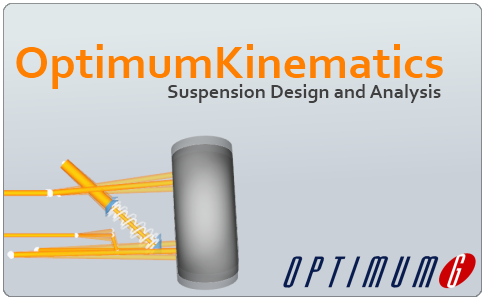

# Welcome

Thank you for purchasing OptimumKinematics, the newest benchmark in kinematics analysis software. This help file contains information regarding the features and functions of OptimumKinematics. 

## Feedback

OptimumKinematics is a continually evolving program 
and we give high regard to any suggestions, comments, 
complaints and/or criticisms that OptimumKinematics users 
might have. Please contact us at [software@optimumg.com](mailto:software@optimumg.com) and we will endeavor to improve OptimumKinematics based on your feedback.
Within OptimumKinematics the user is able to report any issues, features or ideas. Users have the option to report feedback. Read the [Quick Start](2_Quick_Start/2_Quick_Start.md) section to see how to do this.

## Document Overview
The help file can be navigated by clicking on thevarious section links in th document. At the bottom of each sub-section, there is also a link that will bring you back to the beggining of that section. If you re new to OptimumKinematics, then you should start by reading through the [Quick Start](2_Quick_Start/2_Quick_Start.md) guide.

1. [Introduction](1_Introduction/1_Introduction.md)
    * [Installation Requirements](1_Introduction/A_Installation_Requirements.md)
    * [Licensing](1_Introduction/B_Licensing.md)    
2. [Quick Start](2_Quick_Start/2_Quick_Start.md)
    * [Launching the Application](2_Quick_Start/A_Launching_the_Application.md)
    * [Options Menu](2_Quick_Start/B_Options_Menu.md)
    * [Design Overview](2_Quick_Start/C_Design_Overview.md)
    * [Simulation Overview](2_Quick_Start/D_Simulation_Overview.md)
    * [Analysis Overview](2_Quick_Start/E_Analysis_Overview.md)
3. [Detailed Overview](3_Detailed_Overview/3_Detailed_Overview.md)
   * [Reference System](3_Detailed_Overview/A_Reference_System.md)
   * [Design](3_Detailed_Overview/B_Design.md)
   * [Simulation](3_Detailed_Overview/C_Simulation.md)
   * [Analysis](3_Detailed_Overview/D_Analysis.md)

4. [Frequently Asked Questions](4_Frequently_Asked_Questions/4_Frequently_Asked_Questions.md)